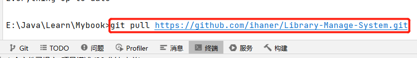
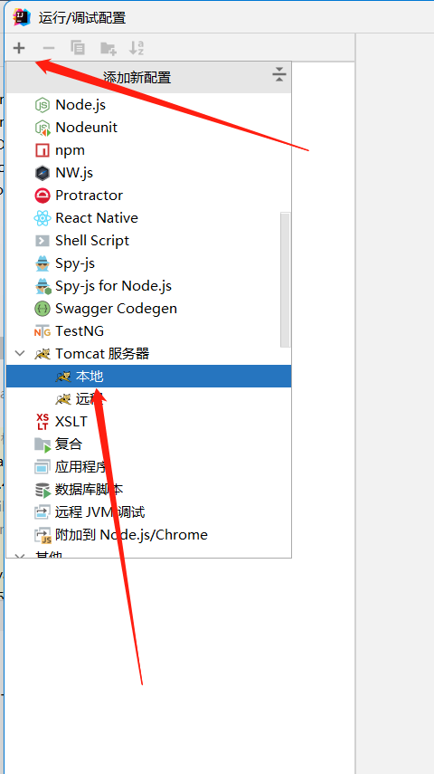
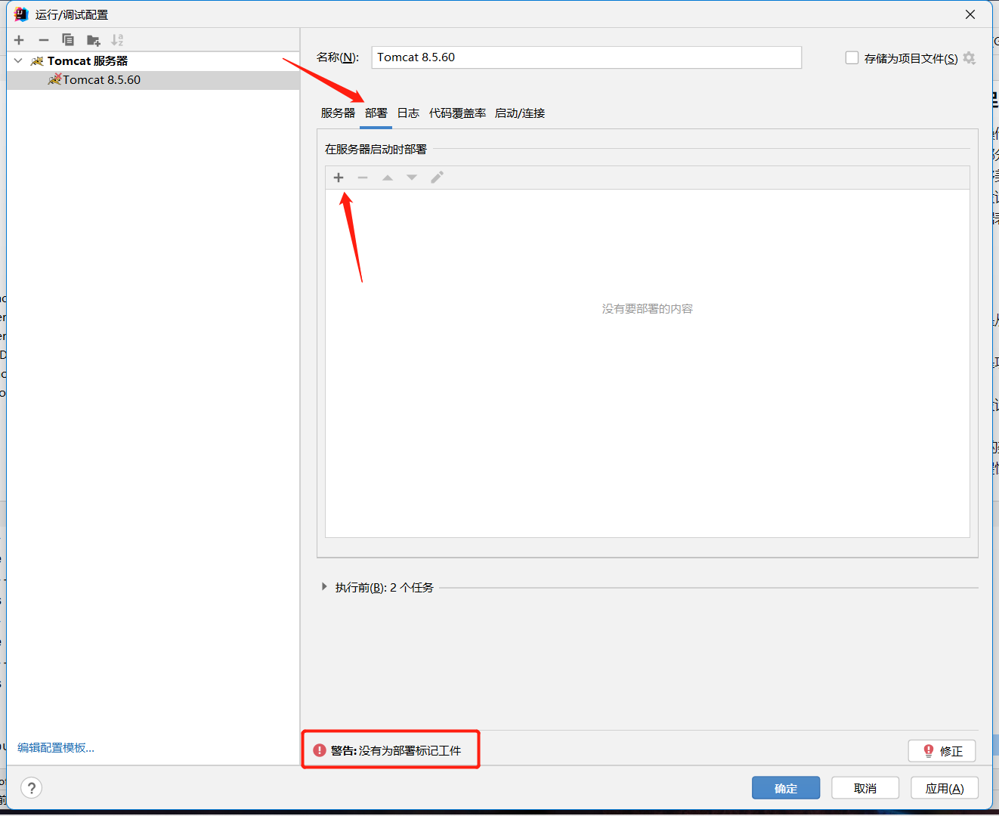
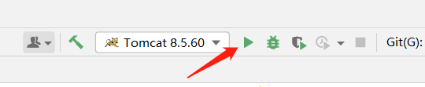

# 基于Java语言的Servlet技术完成的图书管理系统

## 项目介绍

&emsp;&emsp;本项目是本人在大三阶段，学习完了Java
Web相关的知识点，为了对知识点进行总结和更好的掌握，编写的一款基于Java语言，Servlet、Jsp、MySQL等技术的实现的图书借阅管理系统。也是本人第一款独立完成能够实现其功能的项目。

&emsp;&emsp;此项目主要完成了会员管理、图书管理、图书类型管理、图书借阅管理...等功能模块，能够实现基本的会员、图书、图书类型的增删改查，以及对会员借阅图书功能的完成。

&emsp;&emsp;项目当中部分功能的实现会在所难免的有小瑕疵，会在文章的末尾进行标注记录，方便后续的重构优化，也方便各位友人的学习和参考。

## 项目环境

- Windows 11
- IntelliJ IDEA 2021.3.1
- Java:JDK1.8
- Tomcat 8.5.60
- Servlet:3.1
- Mysql:5.6
- JSP

## 项目依赖

- c3p0-0.9.5.5
- commons-dbutils-1.7
- commons-fileupload-1.4
- commons-io-2.8.0
- fastjson-1.2.47
- jstl-1.2
- mchange-commons-java-0.2.19
- mysql-connection-java-5.1.42-bin
- standard-1.1.0
- servlet-api-3.1

## 项目结构

> 主要的项目模块及功能

### 会员管理（✅已完成）

- 会员开卡：即会员注册
- 会员管理：对会员的修改和删除
- 会员充值：对会员余额的充值

### 图书管理（✅已完成）

> 查询图书列表及添加图书

- 图书列表：图书的所有信息
- 添加图书：增加一个图书至库存

### 图书类型管理（✅已完成）

- 类型列表：图书类型的展示
- 添加类型：添加一个图书类型

### 借阅管理（✅已完成）

- 图书借阅
- 图书归还
- 借阅记录查询

### 个人中心（✅已完成）

- 修改密码：修改用户密码

## 项目技术点

- Java的文件上传
- Cookie和Session的使用
- SQL语句的增删改查
- MVC的项目流程控制
- 前后端使用Json格式数据交互

## 项目小结

### ❎缺点和不足

1. 对部分数据操作的业务，没有使用事务，这将会使得部分操作出现不可预知的危险
2. 前端页面不够美观
3. 项目的需求设计不够严谨
4. 数据库中数据表没有将部分有关系的表进行关联。

### ✅收获

1. 项目的设计是从前到后，即从用户需求到后端开发
2. 项目的核心是项目设计，而并非项目开发。
3. 项目的良好设计，能决定项目的完整性和严密性
4. 学到了MVC的架构模式，将业务解耦，从而增加可扩展性和逻辑性

## 项目运行步骤

1. 将项目pull到本地

   

2. 为项目添加本地环境服务器

   

3. 为项目添加工件

   

   
4. 运行项目

   

5. 此时项目就可以正常运行了